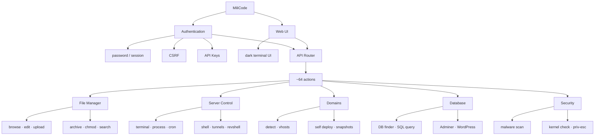

# MiliCode

Single-file web file manager and server administration interface with **20+ features** (file manager, terminal, deploy, database, security, and more). One `index.php` contains the complete PHP backend, web UI, CSS, and JavaScript. **No framework. No Composer. No build step.** Deployment is intentionally simple: **upload the file and run it.**

Compatible with **PHP 5.3.3–8.x** on Windows and Linux. Theme: terminal.sexy *Default Dark* (Base16, Chris Kempson).



## Features

MiliCode ships **20+ features** in one file, a full file manager plus server, domain, database, and security tools. The list below is explicit. More actions exist in the API router (~64 endpoints).

**File manager (10+):** browse with breadcrumbs · search by name · text editor · upload with progress · unzip/untar (`zip`, `tar.gz`, `tar`, `rar`) · zip a selection · chmod · touch · rename · cut / copy / paste · bulk delete

**And more:** in-browser terminal · process list/kill · cron editor · ngrok / gsocket tunnels · Domain Detect · Self Deploy with snapshots · DB Finder · ad-hoc SQL · Adminer · WordPress tools · malware / grep scan · kernel checks

### File Manager

A complete browser-based filesystem interface for direct server-side work. Explicitly included:

- Browse directories with clickable breadcrumbs
- Search files and folders by name
- Edit text files in the built-in editor
- Upload one or many files, with a progress bar
- Extract archives: `zip`, `tar.gz`, `tar`, `rar`
- Download a folder or selection as ZIP
- Change permissions (`chmod`) and timestamps (`touch`)
- Rename, cut, copy, paste
- Bulk delete of selected items

### Server Control

Direct server control from the same UI. Explicitly included:

- In-browser terminal (`mc=sh`)
- Process list and kill
- Cron read / write
- Tunnel integrations: **ngrok** and **gsocket**

Terminal access can be turned off with:

```php
$MILICODE_TERM = false;
```

### Domains

- **Domain Detect** finds site roots from the filesystem, WordPress trees, `public/index.php` folder-sites, `.env`, `wp-config`, and Apache/Nginx virtual hosts
- **Self Deploy** clones MiliCode into selected document roots
- **Snapshots** keep a copy so a deploy can be reverted

### Database

- Find database credentials on disk (**DB Finder**)
- Run ad-hoc SQL
- Deploy **Adminer**
- WordPress tools: scan installs, list users, change password or site URL, add an administrator

### Security

- Recursive grep across PHP files
- Malware-oriented scan of PHP trees
- Kernel / privilege-escalation checks

## Setup

1. Upload `index.php` to the target document root or a subfolder.

2. Set `$AUTH_PASSWORD` in the configuration block at the top of the file.

3. Optionally configure `$JAIL` to enforce a filesystem boundary. An empty value permits access to the broader filesystem available to the PHP process.

```php
$AUTH_PASSWORD = 'didupooptoday?';

$START_DIR     = __DIR__;

$JAIL          = '';          // e.g. __DIR__ to restrict access to this directory tree

$MILICODE_TERM = true;
```

Local overrides can be stored in `.sys_cfg.php` alongside the script and are **preserved during self-update operations**.
