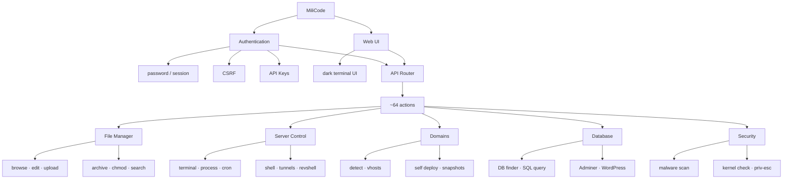

# MiliCode

Single-file web file manager. One `index.php` holds the PHP backend, UI, CSS, and JavaScript. No framework, no Composer, no build step. Deploy = upload that file to the server.

Compatible with **PHP 5.3.3–8.x** on Windows and Linux. Theme: terminal.sexy *Default Dark* (Base16, Chris Kempson).

Indonesian version: [README.md](README.md)

```
                         MiliCode
                            │
              ┌─────────────┴─────────────┐
              │                           │
        Authentication                 Web UI
       password/session              dark terminal UI
        CSRF/API Keys
              │                           │
              └─────────────┬─────────────┘
                            │
                      API Router
                       ~64 actions
                            │
    ┌───────────┬───────────┼─────────────┬────────────┐
    │           │           │             │            │
 File Manager  Server     Domains       Database    Security
    │          Control       │             │            │
 browse        terminal    detect        DB finder    malware scan
 edit          process     vhosts        SQL query    kernel check
 upload        cron        self deploy   Adminer      priv-esc
 archive       shell       snapshots     WordPress
 chmod         tunnels
 search        revshell
```



## Features

### File Manager

Browse folders with breadcrumbs, search by name, edit text files, upload with a progress bar, unzip/untar (zip, tar.gz, tar, rar), zip a selection, chmod, touch, rename, cut/copy/paste, and bulk delete.

### Server Control

In-browser terminal, process list/kill, cron read/write, and tunnels (ngrok, gsocket). Turn the terminal off with `$MILICODE_TERM = false`.

### Domains

Domain Detect finds site roots from the filesystem, WordPress / `public/index.php` folder-sites, `.env`, `wp-config`, and Apache/Nginx vhosts. Self Deploy clones MiliCode into selected docroots and keeps snapshots so a deploy can be reverted.

### Database

Find credentials on disk, run ad-hoc SQL, deploy Adminer, and manage WordPress (scan installs, users, password/URL, add admin).

### Security

Grep and malware scan over PHP files, plus kernel / privilege-escalation checks.

## Setup

1. Upload `index.php` to a docroot or subfolder.
2. Set `$AUTH_PASSWORD` in the config block at the top of the file.
3. Optionally set `$JAIL` so access cannot leave one folder tree. Empty = the whole filesystem.

```php
$AUTH_PASSWORD = 'change-this';
$START_DIR     = __DIR__;
$JAIL          = '';          // e.g. __DIR__ to lock the script to its own folder
$MILICODE_TERM  = true;
```

Local overrides can live in `.sys_cfg.php` next to the script (not overwritten by self-update).
