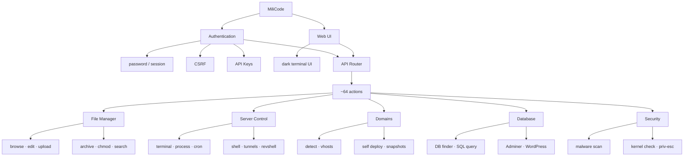

# MiliCode

Single-file web file manager and server administration interface. One `index.php` contains the complete PHP backend, web UI, CSS, and JavaScript. **No framework. No Composer. No build step.** Deployment is intentionally simple: **upload the file and run it.**

Compatible with **PHP 5.3.3–8.x** on Windows and Linux. Theme: terminal.sexy *Default Dark* (Base16, Chris Kempson).



## Features

### File Manager

A complete browser-based filesystem interface built for direct and efficient server-side management.

Browse folders with breadcrumbs, search by name, edit text files, upload with a progress bar, extract archives (`zip`, `tar.gz`, `tar`, `rar`), create ZIP archives from selected files, manage permissions with `chmod`, update timestamps with `touch`, rename, cut/copy/paste, and perform bulk deletion.

### Server Control

Direct server control from a terminal-oriented web interface.

Provides an in-browser terminal, process listing and termination, cron read/write operations, and tunnel integrations including **ngrok** and **gsocket**.

Terminal access can be explicitly disabled with:

```php
$MILICODE_TERM = false;
```

### Domains

Domain Detect identifies potential site roots directly from the server environment, including filesystem layouts, WordPress installations, `public/index.php` folder-sites, `.env`, `wp-config`, and Apache/Nginx virtual-host configurations.

Self Deploy can clone MiliCode into selected document roots while maintaining snapshots, allowing deployments to be reverted when necessary.

### Database

Built-in database utilities for locating application configuration and performing authorized database administration tasks.

Find database credentials on disk, execute ad-hoc SQL queries, deploy Adminer, and manage WordPress installations including installation scanning, user management, password/URL administration, and administrator creation.

### Security

Integrated filesystem and server diagnostics for security-focused administration.

Perform recursive grep and malware scanning across PHP files, alongside kernel inspection and privilege-escalation checks.

## Setup

1. Upload `index.php` to the target document root or a subfolder.

2. Set `$AUTH_PASSWORD` in the configuration block at the top of the file.

3. Optionally configure `$JAIL` to enforce a filesystem boundary. An empty value permits access to the broader filesystem available to the PHP process.

```php
$AUTH_PASSWORD = 'didupooptoday?';

$START_DIR     = __DIR__;

$JAIL          = '';          // e.g. __DIR__ to restrict access to this directory tree

$MILICODE_TERM = true;
```

Local overrides can be stored in `.sys_cfg.php` alongside the script and are **preserved during self-update operations**.
