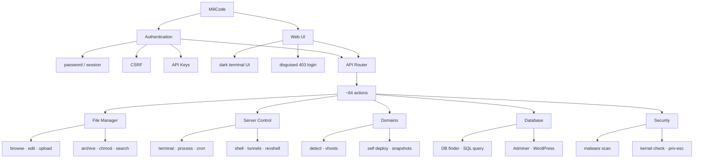

# MiliCode

Single-file web file manager. One `index.php` holds the PHP backend, UI, CSS, and JavaScript. No framework, no Composer, no build step. Deploy = upload that file to the server.

Compatible with **PHP 5.3.3–8.x** on Windows and Linux. Theme: terminal.sexy *Default Dark* (Base16, Chris Kempson).

Indonesian version: [README.md](README.md)

```
                         MiliCode
                            │
              ┌─────────────┴─────────────┐
              │                           │
        Authentication                 Web UI
       password/session              dark terminal UI
        CSRF/API Keys              disguised 403 login
              │                           │
              └─────────────┬─────────────┘
                            │
                      API Router
                       ~64 actions
                            │
    ┌───────────┬───────────┼─────────────┬────────────┐
    │           │           │             │            │
 File Manager  Server     Domains       Database    Security
    │          Control       │             │            │
 browse        terminal    detect        DB finder    malware scan
 edit          process     vhosts        SQL query    kernel check
 upload        cron        self deploy   Adminer      priv-esc
 archive       shell       snapshots     WordPress
 chmod         tunnels
 search        revshell
```



## Request flow

```
Browser
   │
   ├─ GET index.php
   │     ├─ not logged in + $MILICODE_LAYER  →  Forbidden page
   │     │                                     Shift+L opens the password form
   │     └─ logged in                        →  file manager shell
   │
   └─ POST index.php   field mc=<action>     (WAF-safe)
        or GET ?api=<action>                 (fallback / downloads)
              │
              ▼
        Authentication
           session cookie  or  mc_atk
           CSRF on write actions
           optional API key (limited automation)
              │
              ▼
        API Router
           list, upload, sh, domain_roots, …
              │
              ▼
        JSON  /  file  /  zip
```

1. Open the script in a browser. If the disguise layer is on, you see a 403 page. `Shift+L` opens the login form.
2. A correct password starts a PHP session plus a backup auth cookie. Every mutation uses a CSRF token.
3. The UI talks to the router. Write actions go out as POST: action name in `mc`, absolute paths as base64 (`p`), terminal commands as base64 (`x64`). That avoids Plesk/Apache WAFs that drop `?api=upload` or `cmd=ls`.
4. The router splits work across the five groups below.

## Modules

### File Manager

Folder browse, breadcrumbs, name search, text editor, upload (progress bar), unzip/untar (zip, tar.gz, tar, rar), zip selection, chmod, touch, rename, cut/copy/paste, bulk delete.

### Server Control

Terminal (`mc=sh`), process list/kill, cron read/write, tunnels (ngrok, gsocket), reverse-shell helper. Turn the terminal off with `$MILICODE_TERM = false`.

### Domains

Domain Detect reads the filesystem, folder-sites (WordPress / `public/index.php`), `.env`, `wp-config`, and Apache/Nginx vhosts. Self Deploy clones MiliCode into selected docroots, with snapshots/cache for revert.

### Database

DB Finder, ad-hoc SQL, Adminer deploy, plus WordPress tools (scan, users, change password/URL, add admin).

### Security

Grep / malware scan over PHP files, kernel/priv-esc check, and the AutoPrivEsc helper. These are aggressive — do not run them on a server you do not own.

## Run it

1. Upload `index.php` to a docroot or subfolder.
2. Change `$AUTH_PASSWORD` in the config block at the top of the file.
3. Optionally set `$JAIL` so access cannot leave one folder tree. Empty = the whole filesystem.
4. Open the file URL. Press `Shift+L` if you see Forbidden.

```php
$AUTH_PASSWORD = 'change-this';
$START_DIR     = __DIR__;
$JAIL          = '';          // e.g. __DIR__ to lock the script to its own folder
$MILICODE_LAYER = true;       // login disguised as 403
$MILICODE_TERM  = true;
```

Local overrides can live in `.sys_cfg.php` next to the script (not overwritten by self-update).

## API at a glance

| Method | Used for |
| --- | --- |
| `POST` + `mc` | almost every UI action (list, upload, sh, deploy, …) |
| `GET ?api=` | fallback, downloads, preview (`raw`, `download`, `zip`) |
| `X-MiliCode-Key` / `api_key` | limited automation: list, mkdir, upload, unzip, delete, whoami |

Example: `mc=list` + `p=<base64-path>` returns the folder listing as JSON.

## Hosting limits

Some panels (Plesk, LiteSpeed, ModSecurity) drop requests that look like path traversal or command injection. MiliCode already sends paths and terminal commands as base64. Still watch PHP `upload_max_filesize` / `post_max_size` — larger files fail even when the WAF lets the request through.

## License

Private project. Change `$AUTHOR_NAME` and `$AUTHOR_URL` in the config if you repackage it.
